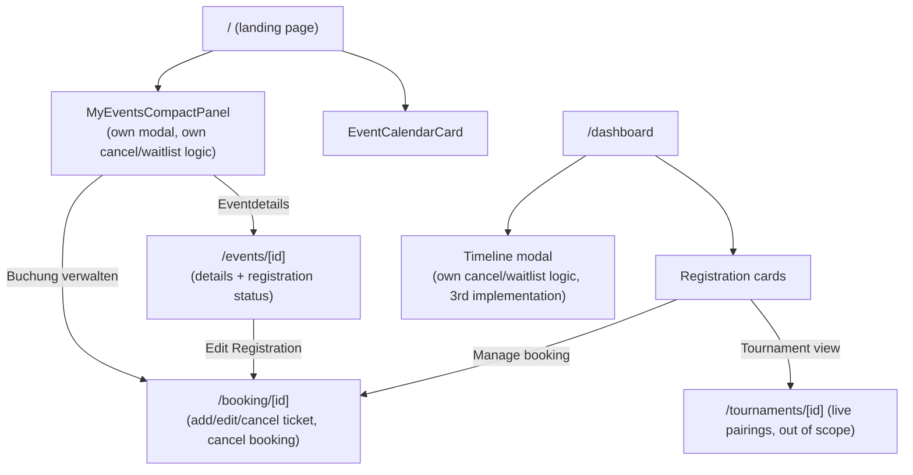
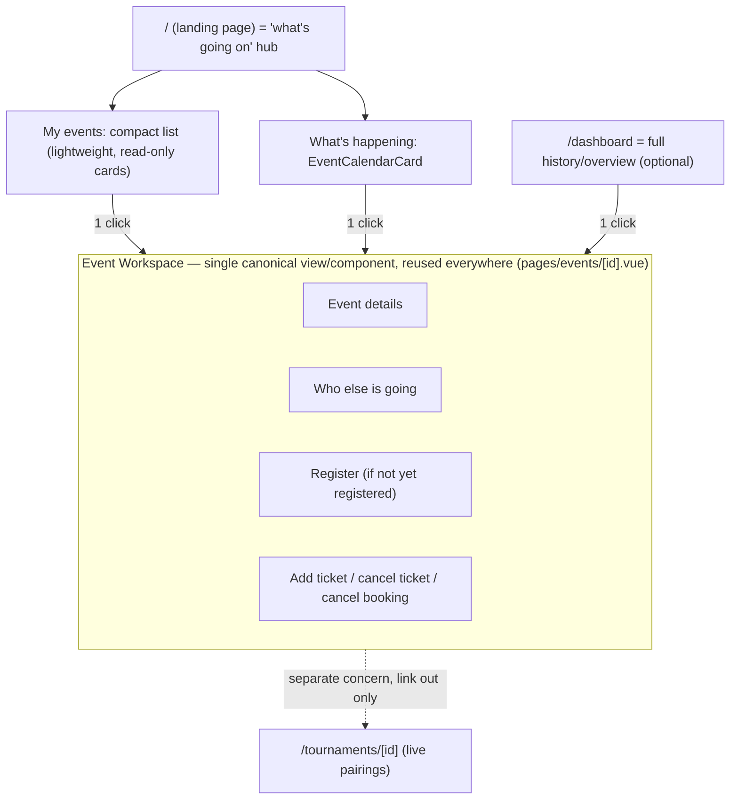

# Frontend Usability Improvements Checklist

Date: 2026-08-09 (revised — user journey re-prioritized ahead of admin work)
Scope: normal user journey (find → register → lookup/manage), then admin quick-glance participant visibility and event creation friction (duplicate/recurring)
Out of scope: unrelated admin panel rework items already tracked in `ADMIN_PANEL_REWORK_CHECKLIST.md`, visual/theme polish, auth/identity work, live in-tournament pairings/bracket views (`pages/tournaments/[id].vue`) — that's a distinct concern from pre-event lookup

Source audit: usability review of `pages/index.vue`, `pages/events/`, `pages/booking/[id].vue`, `pages/dashboard.vue`, `components/EventList.vue`, `components/AdminEventsManager.vue`, `components/EventParticipants.vue`, `components/landingPageCards/dashboard/MyEventsCompactPanel.vue`, `components/landingPageCards/dashboard/RegistrationMiniEntry.vue` (see chat history 2026-08-09).

## How this checklist works

- Each phase is a self-contained, shippable change.
- Work stops at the end of every phase for manual testing and explicit authorization before the next phase starts.
- A phase is not "done" until its gate is checked off by the user, not just implemented.
- If a gate fails, the phase is fixed in place — later phases do not start until the current gate passes.

---

## Architecture concept: current vs. target

**User journey in scope:** find event → register → lookup (see who's coming, add tickets, cancel/withdraw).

### Current state — the "lookup" step is reimplemented four times

Four surfaces independently know how to cancel a ticket / drop a waitlist claim: `MyEventsCompactPanel.vue`, the dashboard timeline modal, the dashboard registration cards (link out), and `booking/[id].vue`. They call the same APIs but duplicate UI state, copy, and edge-case handling (e.g. "can't cancel the last ticket individually") in three separate places. `events/[id].vue` shows status but can't act — it always links out to `booking/[id]`. This is the concrete cause of "too many views for the same event."

### Target state — one canonical Event Workspace, everything else just links to it

Rules for the target architecture:
- **One place owns registration mutation logic**: add ticket, cancel ticket, cancel booking, claim waitlist spot live in `pages/events/[id].vue` (or a composable it exclusively owns) — not duplicated in landing/dashboard components.
- **Landing page becomes the primary "what's going on" surface**: it already has the right shape (`EventCalendarCard` for upcoming events, `MyEventsCompactPanel` for "my events") — it doesn't need new sections, but its entries should navigate to the canonical Event Workspace instead of opening their own action modal.
- **Dashboard stays as a secondary, optional deep-history view** (all past/future registrations, timeline) — same rule: link to the canonical view, don't reimplement actions.
- **`/booking/[id]` is retired as an independent implementation** — either redirected to `/events/[eventId]`, or removed once nothing links to it directly.
- **One click from "my events" to full lookup**, matching the "minimizing approach" — no intermediate "which page has the cancel button" step.

This re-prioritizes the user-facing consolidation ahead of admin-facing work. Admin phases (participant quick-view, duplicate event, templates) move to the end of this checklist.

---

## Phase 1 — Build the canonical Event Workspace (registered-user actions live in one place)

**Goal:** `pages/events/[id].vue` becomes the one place that can show details, participants, and perform add/edit/cancel-ticket and cancel-booking — matching the old Phase 3 idea, now sequenced first.

- [ ] Move ticket list + "Add Ticket" + per-ticket "Edit"/"Cancel" actions from `pages/booking/[id].vue` into the `userRegistration` block of `pages/events/[id].vue`
- [ ] Move "Cancel Entire Booking" logic into the same page
- [ ] Move waitlist claim/confirm/drop logic (currently duplicated in `MyEventsCompactPanel.vue` and the dashboard timeline modal) into the same page, so it's the single source for that logic too
- [ ] Wire actions to the existing booking/waitlist APIs — no API changes expected
- [ ] `EventParticipants` (already on the page) stays visible alongside the above, so "who else is coming" is on the same screen as the actions
- [ ] Decide and confirm with user: `/booking/[id]` becomes a redirect to `/events/[eventId]`, or is removed once nothing links to it

**Files expected to change:** `pages/events/[id].vue`, `pages/booking/[id].vue`

**GATE 1 — STOP for review**
- [ ] User has tested: add a ticket, edit a ticket, cancel a single ticket, and cancel a whole booking — all from `/events/[id]`
- [ ] User has tested: waitlist claim/confirm/drop works from the same page
- [ ] User has tested: the deadline-based lockout (2 hours before event) still disables actions correctly
- [ ] User has confirmed the fate of the old `/booking/[id]` route
- [ ] User has tested the redesigned layout (hero header, flattened registration panel, participants list) reads well on mobile and on a large/wide desktop screen
- [ ] User has tested the page in both German and English (`/de`/`/en` locale switch) — no leftover hardcoded English strings in the page or its 5 modals
- [ ] User has authorized start of Phase 2

---

## Phase 2 — Point every "lookup" entry point at the canonical Event Workspace

**Goal:** Landing page, dashboard, and any other quick-access surface stop reimplementing cancel/waitlist logic and just navigate to the Phase 1 view in one click.

- [ ] `MyEventsCompactPanel.vue`: replace its bespoke modal's mutation actions (cancel ticket, drop/confirm waitlist, "Buchung verwalten" link) with a single one-click navigation to `/events/[id]` (a lightweight read-only preview popover is fine to keep, but no mutation logic stays here)
- [ ] Dashboard timeline modal (`pages/dashboard.vue`): same change — remove its independent cancel/waitlist implementation, link to `/events/[id]` instead
- [ ] Dashboard registration cards (`components/landingPageCards/dashboard/RegistrationMiniEntry.vue` and the inline cards in `pages/dashboard.vue`): "Manage booking" button points at `/events/[id]` instead of `/booking/[id]`
- [ ] Verify the landing page header's "my tournament" quick link (`layouts/default.vue`) still makes sense once actions move — no change expected there since it targets `/tournaments/[id]`, a separate concern

**Files expected to change:** `components/landingPageCards/dashboard/MyEventsCompactPanel.vue`, `pages/dashboard.vue`, `components/landingPageCards/dashboard/RegistrationMiniEntry.vue`

**GATE 2 — STOP for review**
- [ ] User has tested: clicking a "my event" entry on the landing page lands one click later on the full workspace view, no dead-end modal
- [ ] User has tested: dashboard timeline and registration cards behave the same way
- [ ] User has confirmed no remaining surface reimplements cancel/waitlist logic independently
- [ ] User has authorized start of Phase 3

---

## Phase 3 — Landing page as the "what's going on" hub (polish/verification pass)

**Goal:** Confirm the landing page fully covers "what events are happening" + "what am I registered for" now that Phase 1/2 removed the duplicate logic — this is mostly already in place (`EventCalendarCard` + `MyEventsCompactPanel`), so this phase is about closing gaps, not rebuilding.

- [ ] Confirm guests (not logged in) still get a clear path to register/login from the landing page (already present — verify it still reads well after Phase 2 changes)
- [ ] Confirm logged-in users with zero registrations get a clear nudge toward the event list (matches existing dashboard empty-state pattern)
- [ ] Confirm the "my events" compact list surfaces registrations, bookmarks, and waitlist entries clearly enough to act as the primary lookup entry point (no info that only existed in the old modal gets silently dropped)

**Files expected to change:** `pages/index.vue`, `components/landingPageCards/dashboard/MyEventsCompactPanel.vue` (minor)

**GATE 3 — STOP for review**
- [ ] User has tested the full loop end-to-end as a normal user: land on `/`, see upcoming events, see own registrations, one click into full lookup/manage view
- [ ] User has authorized this to be the completed state of the user-journey work, and start of admin-facing Phase 4

---

## Phase 4 — Admin participant quick-view (no backend changes)

**Goal:** Admin sees who's registered for an event without opening `/admin/events`.

- [ ] Add an admin-only "participants" chip/button to event cards in `components/EventList.vue` (both the card and the details modal), showing live `registrationCount`
- [ ] Clicking the chip expands `EventParticipants` in `compact` mode inline (no navigation), reusing the existing component and `/api/events/[id]/participants` endpoint
- [ ] On `pages/events/[id].vue`, move the `EventParticipants` block above the registration section when `isAdmin` is true, so admins see it without scrolling past registration UI
- [ ] Non-admin behavior is unchanged (no chip, participants list stays in its current position)

**Files expected to change:** `components/EventList.vue`, `pages/events/[id].vue`

**GATE 4 — STOP for review**
- [ ] User has tested: open events list while logged in as admin, confirm participant chip appears and expands inline
- [ ] User has tested: open an event detail page as admin, confirm participants are visible near the top
- [ ] User has tested: same pages as a regular (non-admin) user show no regression
- [ ] User has authorized start of Phase 5

---

## Phase 5 — "Duplicate event" quick action (no backend changes)

**Goal:** Admin can spin up next week's recurring local event in one click instead of retyping ~13 fields.

- [ ] Add a "Duplicate" button next to Edit/Delete in the event details modal in `components/AdminEventsManager.vue`
- [ ] Duplicating pre-fills `eventForm` from the selected event (name, tags, venue, fees, decklist requirement, etc.)
- [ ] `eventDate` and `registrationDeadline` are auto-advanced by 7 days (same weekday/time), still editable before submit
- [ ] Opens the existing create form pre-filled — admin reviews/edits, then submits via the normal create path (`POST /api/admin/custom-events`)
- [ ] Duplicating an external event is disabled (external events already block editing — match that behavior)

**Files expected to change:** `components/AdminEventsManager.vue`

**GATE 5 — STOP for review**
- [ ] User has tested: duplicate a real local weekly event, confirm date shifts +7 days and all fields are correct
- [ ] User has tested: duplicated event saves correctly and appears in the upcoming list
- [ ] User has authorized start of Phase 6

---

## Phase 6 — Recurring event templates (requires backend design)

**Goal:** "Set event → check/edit if necessary → go" for recurring local events, beyond one-off duplication.

> **Delivered out of sequence** at explicit user request ("NUR FÜR ADMINS: Event anlegen button... Prefab Möglichkeit") before Phases 2–5 were authorized. Template management now lives inside the shared create-event modal used from both the landing page and `/admin/events`.

- [x] Design confirmed with user before coding: new `EventTemplate` Prisma model (not a `CustomEvent` flag) storing `weekday` + `eventTime` + full event field set; "next occurrence" computed as the next date matching `weekday`/`eventTime`, rolling to next week if that weekday/time has already passed today
- [x] Backend: template CRUD (create/list/update/delete) following the existing admin service pattern (`server/services/admin/eventTemplateAdminService.ts` → `server/api/admin/event-templates.ts` controller using `defineAdminRoute`, no business logic in the route)
- [x] Frontend: "Save as template" action from the create/edit form (`components/EventEditModal.vue`)
- [x] Frontend: "Create from template" action pre-fills the form with the next computed date; still opens the modal for explicit review/submit (never auto-creates silently)
- [x] Templates list/management surface (create-next-occurrence + edit + delete) — placed inside `components/EventEditModal.vue`; templates are no longer exposed directly on the landing page
- [x] Update: dedicated "edit template" action (`components/EventTemplateEditModal.vue`, `PUT /api/admin/event-templates?id=`) lets admins change any template field in place
- [x] Update: landing page and admin event manager use the same `EventEditModal` create/edit view; successful creation keeps the modal open with a copyable registration link

**Files changed:** `prisma/schema.prisma` (new `EventTemplate` model, deployed through migration `20260831120000_add_event_templates`), `server/services/admin/eventTemplateAdminService.ts` (create/list/update/delete), `server/api/admin/event-templates.ts` (GET/POST/PUT/DELETE), `components/EventEditModal.vue` (now supports create mode via optional `eventId` + `prefill` prop, plus "Save as template"), `components/EventTemplateEditModal.vue` (new — edit an existing template), `components/AdminEventQuickCreate.vue` (new — landing page admin panel), `components/landingPageCards/calendar/EventCalendarCard.vue` (exposes `refresh()`), `pages/index.vue` (renders the new panel, refreshes the calendar on creation), `i18n/locales/de.json` / `en.json` (new `eventWorkspace.*` keys, `common.weekdays`)

**GATE 6 — STOP for review**
- [ ] User has tested: click "Neues Event", fill the form, submit — new event appears in the calendar without a page reload
- [ ] User has tested: fill the create form, click "Als Vorlage speichern", confirm a success toast and the template chip appears
- [ ] User has tested: select a template inside the create modal, confirm the form is pre-filled with the correct next occurrence date/time (test both "weekday still upcoming this week" and "weekday already passed this week" cases)
- [ ] User has tested: delete a template in the create modal, confirm it disappears and doesn't affect existing events
- [ ] User has tested: edit a template in the create modal, change a field, save, and confirm future creation uses the updated values
- [ ] User has tested: create an event from landing page and admin menu, confirm both use the same view and show a copyable registration link after creation
- [ ] User has tested: the panel is invisible to non-admin users
- [ ] User has authorized this checklist as complete for Phase 6

---

## Status

Current phase: **Phase 1 — implemented, awaiting your test + authorization (GATE 1)**

Note: Phase 6 (event templates) was implemented ahead of the gated sequence at your direct request — see its section above for details and GATE 6 for testing steps. Phases 2–5 have not been started.

Implementation notes (2026-08-09):
- `pages/events/[id].vue` now owns booking (add/edit/cancel ticket, cancel entire booking) and waitlist (confirm/drop) mutations directly, using `/api/events/[id]/my-registration` to resolve the booking id and `/api/bookings/[id]` for full ticket/permission data — no new backend endpoints needed.
- `pages/booking/[id].vue` is now a thin redirect: it looks up the booking's event id via `/api/bookings/[id]` and forwards to `/events/[eventId]`, so old links/bookmarks still resolve.
- Not yet done (deferred to Phase 2): `MyEventsCompactPanel.vue` and the dashboard timeline modal still have their own cancel/waitlist logic and their own "Buchung verwalten" links to `/booking/[id]` — those still work (redirect chain), but haven't been repointed at the canonical page directly yet.

Implementation note (2026-09-03):
- Locale-prefixed public routes such as `/en` and `/en/events/...` remain accessible without authentication; protected routes still redirect to login. Mobile verification at 390 px confirmed the localized landing calendar remains visible, while `/en/events/register/...` requires login.

### Design system hardening (done inside Phase 1, before GATE 1 sign-off)

While building the canonical workspace, the page revealed that it (and much of the surrounding UI) had drifted from the app's actual shared design system — hardcoded Discord-dark colors, inconsistent button padding/sizes, and hardcoded English strings mixed into an otherwise German UI ("Denglisch"). Rather than let GATE 1 pass on a visually broken page, this was fixed as part of Phase 1:

- Migrated `pages/events/[id].vue`, its 5 modals, and `components/EventParticipants.vue` off hardcoded colors (`bg-[#2f3136]` etc.) onto the shared `app-*` design tokens already used by `dashboard.vue` and the landing page.
- Added a formal, documented type scale (`app-heading-1/2/3`, `app-body-text`, `app-meta-text`) and button size scale (`app-btn-sm/md/lg`) to `assets/css/tailwind.css`, and applied them consistently across this page instead of ad hoc `text-*`/padding utilities per button.
- Added a new `eventWorkspace`, `waitlist`, and `participants` i18n namespace to both `i18n/locales/de.json` and `en.json`, and replaced every hardcoded English string on the page/modals/participants list with `t()` calls, including the previously English-only relative date formatting ("today"/"2 days ago") in `EventParticipants.vue`.
- Wrote `aidocs/DESIGN_SYSTEM.md` documenting these conventions so future pages don't drift the same way — reference it before styling any new page.

This hardening is captured under GATE 1 above (two new checklist items) rather than as its own phase, since it was a correctness fix to work already in Phase 1's scope, not new functionality.

### Known follow-up (not blocking GATE 1)

- `pages/booking/[id].vue`'s redirect page and the admin-only "Turnier organisieren" button still have a couple of non-critical hardcoded/partial-i18n spots; low priority, can be swept up whenever that page is next touched.
